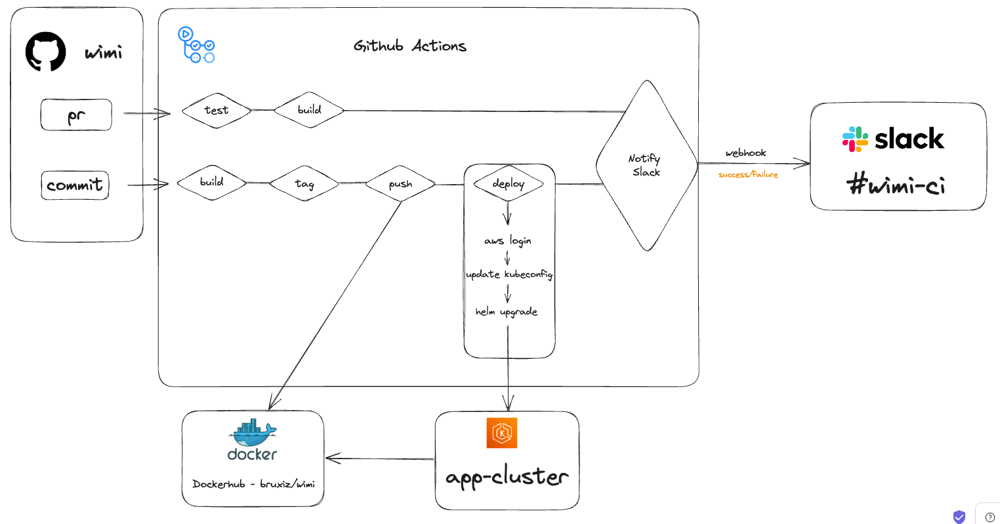

# WIMI - What Is My IP

http://k8s-default-wimiingr-1192713744-2022773118.us-east-1.elb.amazonaws.com/
## WIMI is a web app built using Python and Flask that displays user's IP address.

[dockerhub](https://hub.docker.com/r/bruxiz/wimi)

### CI/CD process visualized below:



## CI Proccess:

### when a PR is raised:

#### test:

- runs test on the app, runs the app and tests the endpoint (used unittest)

#### build:

- runs docker build to verify that the image can be built from Dockerfile

#### slack:

- notifies in the slack channel if failed in one of them / success

### when a PR is merged / direct merge:

#### build + publish:

- build the image, tags it and publishes to dockerhub

#### deploy:

- logins to aws using credentials (access/secret) to authorized role (to perform operations in the cluster)
- runs helm upgrade with the previously generated & pushed version

#### slack:

- notifies in the slack channel if failed in one of them / success


## Prerequisites

- Python3 (https://www.python.org/downloads/)
- Docker (https://docs.docker.com/engine/install/)
- Helm (https://helm.sh/docs/intro/install/)
- Task (https://taskfile.dev/installation/)

## Installation

### Clone the Repository

```bash
git clone https://github.com/bruxiz/wimi.git
cd wimi
```

#### Install Python Dependencies
```bash
pip3 install -r requirements.txt
```

## Using Taskfile

The `Taskfile` can automate various tasks like building the Docker image, publishing it, and running tests. Below are some example usages:

#### Build Docker Image

```bash
task build VERSION=$your_verison
```

#### Publish Docker Image

```bash
task publish VERSION=$your_verison REGISTRY=$your_registry_url DOCKER_USERNAME=$your_username DOCKER_PASSWORD=$your_password
```

#### Run Tests

```bash
task test
```

#### Helm Deployment

The `helm` directory contains Helm charts for deploying this application to a Kubernetes cluster. To deploy the application, run:

```bash
task deploy VERSION=$your_version
```


## Challenges

- versioning pattern (decided about sha+date)
- setting up cluster (had troubles with lb)
- app (first used remote_addr and got internal IPs… then switched to the header passed by the lb + had to install alb_controller)
- testing the CI (act was misfunctioning)
